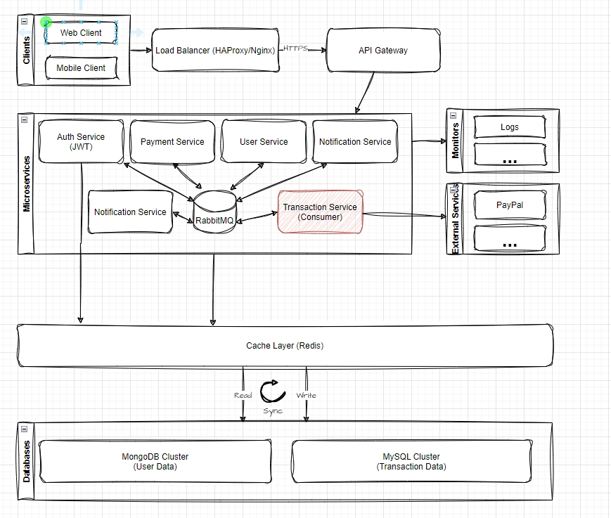

> ⚠️ **Note**: This is an incomplete project created for technical review purposes only. It demonstrates architectural concepts and implementation patterns but is not intended for production use.



# Payment System

A secure, high-performance microservices-based payment processing system built with NestJS, featuring virtual credit transactions, user authentication, and integration with payment gateways.

## Features

- 🔐 Secure user authentication using JWT
- 💳 Virtual credit transaction processing
- 📊 Transaction history tracking
- 🔄 Integration with payment gateways
- 📦 Microservices architecture
- 🗄️ Dual database support (MongoDB & MySQL)
- 🚀 High-performance design with caching
- 🔒 Robust security measures

## Tech Stack

- **Framework:** NestJS
- **Databases:** MongoDB, MySQL
- **Message Broker:** RabbitMQ
- **Caching:** Redis
- **Documentation:** Swagger
- **Container:** Docker
- **Authentication:** JWT

## Project Structure

```
payment-system/
├── apps/               # Microservices applications
├── libs/               # Shared libraries
├── docker/            # Docker configuration files
├── dist/              # Compiled output
└── node_modules/      # Dependencies
```

## Prerequisites

- Node.js (v18 or higher)
- Docker and Docker Compose
- PNPM package manager
- MongoDB
- MySQL
- Redis

## Installation

1. Clone the repository:
   ```bash
   git clone <repository-url>
   cd payment-system
   ```

2. Install dependencies:
   ```bash
   pnpm install
   ```

3. Set up environment variables:
   Create `.env` files for each service based on the provided examples.

4. Start the services using Docker:
   ```bash
   docker-compose up -d
   ```

## Development

- Start in development mode:
  ```bash
  pnpm start:dev
  ```

- Run tests:
  ```bash
  pnpm test
  ```

- Run e2e tests:
  ```bash
  pnpm test:e2e
  ```

- Format code:
  ```bash
  pnpm format
  ```

- Lint code:
  ```bash
  pnpm lint
  ```

## API Documentation

API documentation is available through Swagger UI at `/api/docs` when running the application.

## Architecture

The system follows a microservices architecture with the following components:

- API Gateway
- Authentication Service
- Payment Processing Service
- Transaction Service
- User Service

Each service is independently deployable and communicates through message brokers (RabbitMQ).

## Security Features

- JWT-based authentication
- Request validation and sanitization
- Encrypted sensitive data storage
- HTTPS communication
- Rate limiting
- Input validation

## Contributing

1. Fork the repository
2. Create your feature branch (`git checkout -b feature/amazing-feature`)
3. Commit your changes (`git commit -m 'Add some amazing feature'`)
4. Push to the branch (`git push origin feature/amazing-feature`)
5. Open a Pull Request

## License
MIT
